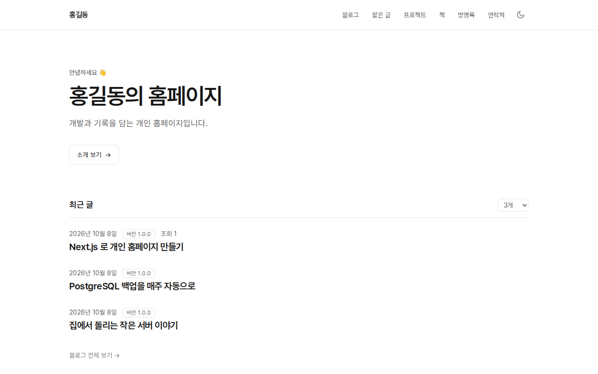
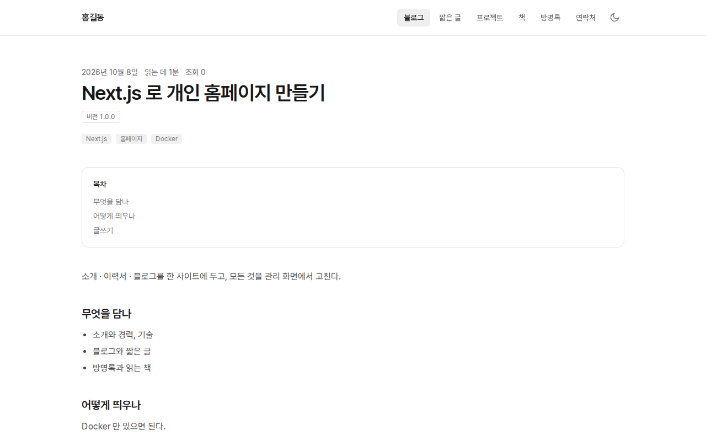
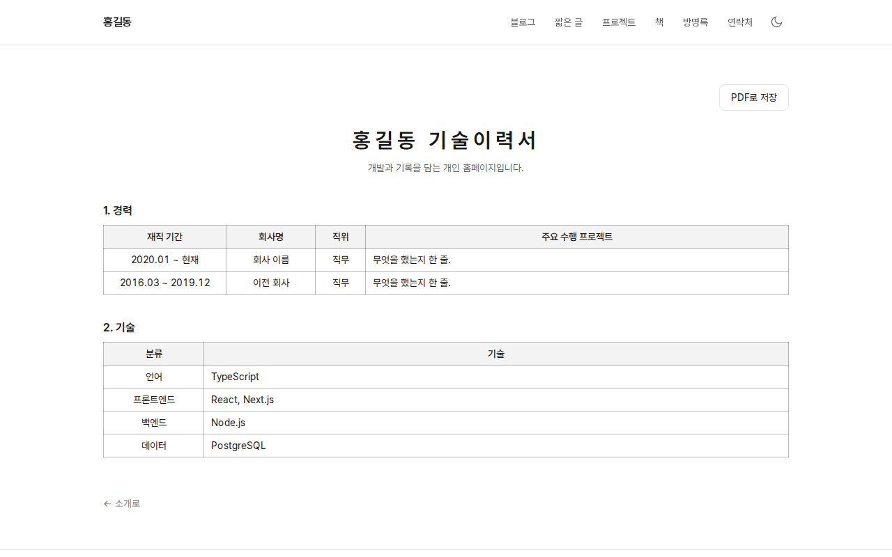
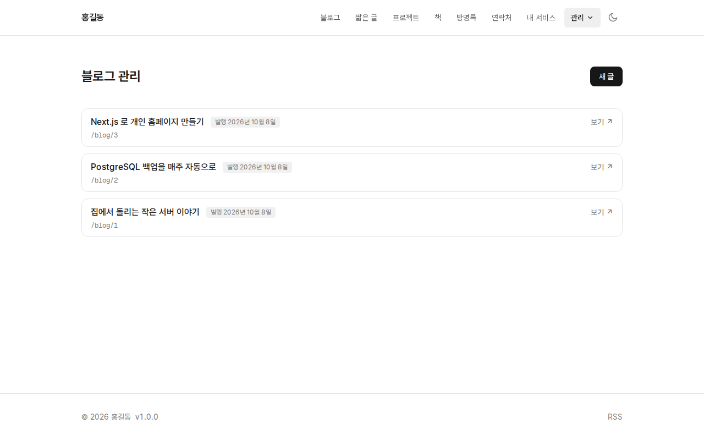

# myhome

> Self-hosted personal homepage — about · résumé · blog · guestbook · reading list,
> plus a private space (diary · notes · to-dos · Google Calendar).
> Next.js + PostgreSQL, one-line Docker install. The UI is in Korean.

혼자 쓰는 개인 홈페이지. 소개 · 이력서 · 블로그 · 짧은 글 · 방명록 · 읽는 책을
한 사이트에 두고, 나만 보는 「내 공간」(일기장 · 메모 · 할 일 · 일정)까지 모두
웹의 관리 화면에서 고친다. 앱 하나와 PostgreSQL 하나로 돈다.

- **소개 · 이력서**: 경력 · 기술 · 수행 업무. 이력서는 기술이력서 표 모양으로
  그리고 브라우저 인쇄로 PDF 로 저장한다. 인적 사항처럼 공개하기 싫은 항목은
  나에게만 보이게 고른다
- **글**: 블로그(목차 · 태그 · 검색 · 연재 · 관련 글 · 예약 발행 · 개정 표시),
  짧은 글, 나만 보는 비밀글(서버에서 암호화해 저장). 마크다운이고 위지윅 편집기 셋
  가운데 고른다. 그림은 붙여넣기 · 끌어놓기로 올린다
- **책**: 읽는 책 · 다 읽은 책, 책마다 독서 노트와 별점
- **사람들과**: 댓글 · 방명록(「나에게만 보내기」 로 연락도). 텔레그램으로
  알림을 받을 수 있다
- **내 공간**(나만 봄, 암호화해 저장): 하루 한 편 일기장, 메모, 할 일, 구글
  캘린더 일정(월간 · 주간). 텔레그램 봇에게 「메모 …」 · 「할일 …」 로 보내도
  들어가고, 어느 화면에서나 ＋ 단추로 바로 적는다
- **관리**: 메뉴 · 사이트 정보 · 코드(분류)를 화면에서 고친다. 패스키 로그인
- **바깥**: 사이트맵 · RSS · 링크 미리보기 이미지 · 검색엔진 등록

한국어로 쓰인 사이트다. 화면 글자와 날짜는 한국어 · 한국 시간이다.

| 첫 화면 | 글 |
| --- | --- |
|  |  |
| **이력서** | **관리 화면** |
|  |  |

실제로 돌고 있는 예: [leechis.dev](https://leechis.dev)

## 5분 안에 띄우기

Docker 와 `docker compose`(v2) 만 있으면 된다. 우분투라면:

```bash
curl -fsSL https://raw.githubusercontent.com/leechis7/myhome-public/main/install.sh | bash
```

설치 폴더 · 포트 · 사이트 주소 · 비밀글을 쓸지 · 데이터를 어디에 둘지를 묻고
([데이터는 어디에](#데이터는-어디에)), 나머지 비밀값은 만들어 넣는다. 끝나면 이렇게 알려 준다.

```
  주소     http://localhost:3000/admin
  설치 코드  7K2Q-9MXD
```

그 주소를 열고 설치 코드와 새 관리자 비밀번호를 넣으면 들어가진다. 설치 코드는
먼저 연 남이 관리자가 되는 것을 막는 것이라, 서버를 띄운 사람만 볼 수 있는
앱 로그에만 찍힌다.

### 손으로 띄우기

스크립트를 쓰지 않으려면 [compose.yaml](compose.yaml) 을 받아 같은 폴더에
`.env` 를 두 줄 쓴다.

```bash
mkdir myhome && cd myhome
curl -fsSLO https://raw.githubusercontent.com/leechis7/myhome-public/main/compose.yaml
cat > .env <<EOF
POSTGRES_PASSWORD=$(openssl rand -hex 24)
SESSION_SECRET=$(openssl rand -base64 32)
EOF
chmod 600 .env
docker compose up -d
docker compose logs app | grep "처음 설정 코드"
```

## 처음 할 일

1. `/admin` 에서 관리자 비밀번호를 정한다(위의 설치 코드)
2. **관리 › 설정 › 사이트**: 이름 · 제목 · 한 줄 소개 · 대표 메일. 비워 두면
   「홍길동」 같은 보기 값이 보인다
3. **관리 › 설정 › 프로필**: 소개 글 · 연락 수단 · 경력 · 기술 · 수행 업무
4. **관리 › 설정 › 암호**: 패스키(얼굴 · 지문)를 등록해 두면 비밀번호 없이 들어온다
5. **관리 › 설정 › 메뉴**: 위쪽 메뉴의 줄과 순서

## 도메인과 HTTPS

앱은 `http://…:3000` 으로만 연다. 바깥에 내놓을 때는 앞에 리버스 프록시를 두고,
`.env` 의 `SITE_URL` 을 바깥 주소로 바꾼다(캐노니컬 · 사이트맵 · 공유 카드가
쓴다).

[Caddy](https://caddyserver.com/) 라면 인증서까지 저절로 받는다.

```
example.com {
	# https 로만 오게 한다(앱은 http 라 이 머리글을 붙이지 않는다)
	header Strict-Transport-Security "max-age=63072000"
	# 바깥에서 오는 요청 크기를 자른다. 그림 · 첨부를 올리는 관리 화면은 뺀다
	@not_upload not path /admin/*
	request_body @not_upload {
		max_size 1MB
	}
	reverse_proxy 127.0.0.1:3000
}
```

앱이 보안 머리글(CSP · X-Frame-Options 등)은 스스로 붙인다. 프록시가 없으면
요청 크기는 앱의 한도(100MB, 그림 올리기 때문)까지 받는다 — 바깥에 내놓을
때는 위처럼 프록시에서 자르기를 권한다.

```bash
# .env
SITE_URL=https://example.com
```

`.env` 를 고친 뒤에는 `docker compose up -d` 로 다시 띄운다.

## 새 판으로 올리기

```bash
cd ~/myhome
docker compose pull
docker compose up -d
```

DB 마이그레이션은 앱보다 먼저 저절로 돈다. 무엇이 바뀌었는지는
[CHANGELOG.md](CHANGELOG.md) 에 있다. 판을 고정하려면 `.env` 에
`MYHOME_VERSION=1.0.0` 처럼 적는다(비우면 `latest`).

## 데이터는 어디에

남겨야 할 것은 셋이다: DB(글 · 설정), 첨부파일(글에 넣은 그림 포함), 비밀글 첨부파일. 둘 중
한 곳에 둔다. 설치할 때 install.sh 가 묻는다.

| | Docker 볼륨 (기본) | 설치 폴더의 `data/` |
| --- | --- | --- |
| 자리 | `/var/lib/docker/volumes/myhome-local_{db,uploads,secrets}` | `~/myhome/data/{db,uploads,secrets}` |
| 찾기 | `docker volume ls` 로 본다. 폴더를 보려면 `sudo` | 설치 폴더 안에 보인다 |
| 옮기기 · 담기 | 볼륨마다 `docker run … tar` 로 꺼낸다 | 멈추고 설치 폴더를 통째로 복사하면 끝 |
| 파일 주인 | Docker 가 맞춘다. 신경 쓸 일이 없다 | 컨테이너 사용자(DB 는 uid 70, 첨부파일은 uid 1000)라, 열거나 지울 때 `sudo` 가 필요할 수 있다 |
| 지우기 | `docker compose down -v` | `down` 하고 `sudo rm -rf data` |

**왜 기본이 볼륨인가.** 권한 탈이 없다. 컨테이너 안의 DB 와 앱은 내 계정이
아닌 저마다의 사용자로 도는데, 볼륨은 Docker 가 그 주인을 알아서 맞춘다.
`docker compose down` 을 해도 남고, 실수로 설치 폴더를 지워도 글이 살아 있다.
한 서버에 오래 두고 쓸 거라면 이쪽이 편하다.

**왜 설치 폴더에 두나.** 「myhome 의 모든 것은 이 폴더에 있다」 가 된다.
무엇이 어디에 얼마나 있는지 눈으로 보이고, 다른 서버로 옮길 때 폴더 하나를
`rsync` 하면 되고, 서버 백업이 이미 홈 폴더를 담고 있다면 따로 할 일이 없다.
노트북에서 시험 삼아 띄우거나 자주 옮길 거라면 이쪽이 편하다.

어느 쪽이든 앱은 똑같이 돈다. 설치 폴더에 두기로 하면 install.sh 가
`compose.override.yaml` 을 만든다. `compose.yaml` 은 그대로라, 새로 받아도
이 설정은 남는다.

```yaml
# compose.override.yaml - docker compose 가 compose.yaml 과 함께 저절로 읽는다
services:
  postgres:
    volumes:
      - ./data/db:/var/lib/postgresql
  app:
    volumes:
      - ./data/uploads:/app/storage/uploads
      - ./data/secrets:/app/storage/secrets
```

### 볼륨으로 깐 것을 설치 폴더로 옮기기

```bash
cd ~/myhome
docker compose down
mkdir -p data
for v in db uploads secrets; do        # 주인 · 권한 그대로 복사한다
  docker run --rm -v myhome-local_$v:/from -v "$PWD/data/$v":/to alpine cp -a /from/. /to/
done
# 위의 compose.override.yaml 을 만든다
docker compose up -d
# 글 · 첨부파일이 그대로인지 보고, 옛 볼륨을 지운다(선택)
docker volume rm myhome-local_db myhome-local_uploads myhome-local_secrets
```

거꾸로(폴더 → 볼륨)는 `compose.override.yaml` 을 지우고 같은 `cp -a` 를
방향만 바꿔 돌린다.

## 백업

글 · 설정은 DB 에, 첨부파일은 파일로 있다. 둘 다 담는다.

**Docker 볼륨(기본)이면**

```bash
cd ~/myhome
docker compose exec -T postgres pg_dump -U myhome myhome | gzip > myhome-$(date +%F).sql.gz
docker run --rm -v myhome-local_uploads:/data -v "$PWD":/out alpine \
  tar czf /out/uploads-$(date +%F).tar.gz -C /data .
docker run --rm -v myhome-local_secrets:/data -v "$PWD":/out alpine \
  tar czf /out/secrets-$(date +%F).tar.gz -C /data .
```

**설치 폴더의 `data/` 면** DB 는 돌고 있는 채로 파일을 복사하면 깨질 수 있다.
`pg_dump` 로 받거나, 잠깐 멈추고 폴더째 담는다.

```bash
cd ~/myhome
docker compose exec -T postgres pg_dump -U myhome myhome | gzip > myhome-$(date +%F).sql.gz
sudo tar czf uploads-$(date +%F).tar.gz -C data uploads secrets
# 또는: docker compose stop && sudo tar czf myhome-$(date +%F).tar.gz . && docker compose start
```

비밀글을 쓴다면 `.env` 의 `SECRETS_KEY` 를 **따로** 보관한다. 이 열쇠를 잃으면
백업이 있어도 비밀글을 읽을 수 없다.

## 멈추기 · 지우기

```bash
cd ~/myhome
docker compose stop        # 잠깐 멈춘다. docker compose start 로 다시 띄운다
docker compose down        # 컨테이너를 지운다. 글 · 첨부파일(데이터)은 남는다
```

**통째로 지우기.** 글 · 첨부파일 · 설정이 모두 사라지고 되돌릴 수 없다. 남길
것이 있으면 먼저 [백업](#백업)한다.

```bash
cd ~/myhome
docker compose down -v --rmi all   # 컨테이너 · Docker 볼륨 · 받은 이미지까지
cd ~ && sudo rm -rf ~/myhome       # .env · compose.yaml (설치 폴더에 둔 data/ 도)
```

- `sudo` 는 데이터를 설치 폴더의 `data/` 에 두었을 때 필요하다. 그 안의
  파일 주인이 컨테이너 사용자라 내 계정으로는 지워지지 않는다. Docker 볼륨에
  두었다면 `rm -rf ~/myhome` 으로 된다
- 남은 것이 없는지 본다: `docker volume ls | grep myhome-local`,
  `docker ps -a | grep myhome-local`
- 도메인을 붙였다면 리버스 프록시(Caddy 등)의 설정도 지운다

## 설정(.env)

`compose.yaml` 이 읽는다. 꼭 필요한 것은 둘이고 나머지는 비우면 꺼진다.

| 변수 | 설명 |
| --- | --- |
| `POSTGRES_PASSWORD` | **필수.** DB 비밀번호. 처음 띄운 뒤에는 바꾸지 않는다 |
| `SESSION_SECRET` | **필수.** 로그인 쿠키를 암호화하는 열쇠(32자 이상). `openssl rand -base64 32` |
| `SITE_URL` | 바깥에서 들어오는 주소. 기본 `http://localhost:3000` |
| `PORT` | 여는 포트. 기본 `3000` |
| `MYHOME_VERSION` | 쓸 이미지 판. 기본 `latest` |
| `ADMIN_PASSWORD` | 처음 관리자 비밀번호. 비우면 처음 `/admin` 에서 설치 코드로 정한다 |
| `SECRETS_KEY` | 비밀글 열쇠(32바이트 base64). 비우면 비밀글이 꺼지고 메뉴에서 빠진다 |
| `TELEGRAM_BOT_TOKEN` · `TELEGRAM_CHAT_ID` | 댓글 · 연락 · 방명록 알림 |
| `TELEGRAM_INBOX` | `off` 면 이 서버에서는 텔레그램 메모 · 할 일을 받지 않는다(같은 봇을 쓰는 개발기 등). 봇 하나에 받는 곳은 하나뿐이다 |
| `KAKAO_REST_API_KEY` | 관리 › 책 의 책 찾기를 카카오 책 검색으로 한다([developers.kakao.com](https://developers.kakao.com) 앱의 REST API 키). 비우면 열쇠가 필요 없는 Open Library 로 찾는다 — 한국 책은 적다 |
| `UMAMI_WEBSITE_ID` | [umami](https://umami.is/) 방문 통계. 비우면 추적 스크립트가 나가지 않는다 |
| `NEXT_PUBLIC_GOOGLE_SITE_VERIFICATION` | Search Console 소유 확인 |
| `MONITORING_DASHBOARD` | 관리 › 감시 화면에 끼울 Grafana 대시보드 경로. 비우면 메뉴에서 빠진다 |
| `TZ` | 시간대. 기본 `Asia/Seoul` |

## 소스로 고쳐 쓰기

Node 24, PostgreSQL 이 필요하다.

```bash
npm install
cp .env.example .env.local     # DATABASE_URL · SESSION_SECRET 을 채운다
npm run db:migrate
npm run dev                    # http://localhost:40002
```

소스로 이미지를 빌드해 띄우려면 `docker compose up -d --build`.

| 명령 | 하는 일 |
| --- | --- |
| `npm run lint` | ESLint |
| `npm run typecheck` | 라우트 타입을 만들고 타입 검사 |
| `npm test` | 단위 시험(Vitest) |
| `npm run test:e2e` | 브라우저 시험(Playwright). 떠 있는 개발 서버를 대상으로 하고, 관리자 비밀번호를 `E2E_ADMIN_PASSWORD` 로 준다. 글을 만들고 지우므로 운영 DB 에 대고 돌리지 않는다 |

Next.js 16(App Router) · React 19 · TypeScript · Tailwind CSS v4 · PostgreSQL 18 ·
Drizzle ORM · iron-session · SimpleWebAuthn.

## 기여 · 보안

이슈 · PR 은 고맙게 받는다. PR 을 받는 방식이 조금 특이하니
[CONTRIBUTING.md](CONTRIBUTING.md) 를 먼저 본다. 보안 문제는 공개 이슈 대신
[SECURITY.md](SECURITY.md) 대로 비공개로 알린다.

## 라이선스

Copyright (c) 2026 이채강

[GNU Affero General Public License v3.0](LICENSE)(AGPL-3.0). 자유롭게 쓰고
고치고 나눠도 되지만, 고친 것을 남에게 주거나 **웹 서비스로 띄우면 그 소스도
같은 라이선스로 공개해야 한다.**
